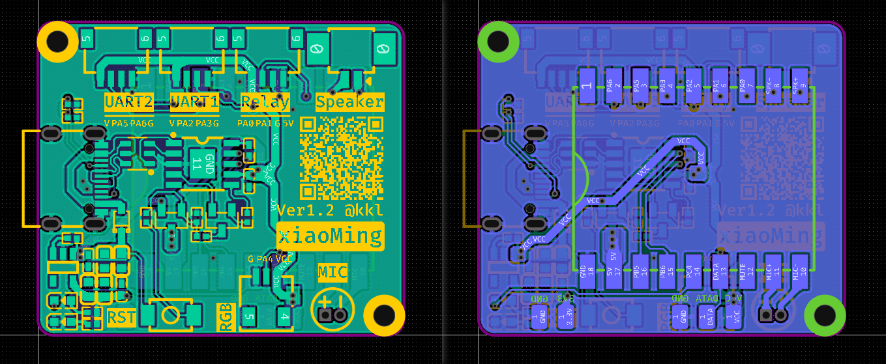

# 🔧 xiaoMing 硬件设计 · v1.2

> 语音灯箱主控板的原理图与 PCB 工程

---

## 📷 原理图

---

## 📦 工程文件

| 文件 | 说明 |
| --- | --- |
| `ProPrj_xiaoMing-v1.2_2026-09-18.epro2` | 立创EDA 专业版工程（原理图 + PCB） |

用**立创EDA 专业版**打开。

---

## 🧩 板载功能分区

以下分区名称取自原理图上的框注：

| 分区 | 说明 |
| --- | --- |
| USB-C | USB Type-C 接口，供电 + 数据 |
| CH340串口通信 | USB ↔ 串口转换 |
| Auto-Download | 免按键自动下载电路 |
| 3V3-LDO | 3.3V 稳压 |
| Core | ASRPRO-CORE 主控核心板 |
| 指示灯 | 电源红灯 + 用户灯 |
| 麦克风 | 驻极体麦克风 |
| 扬声器 | 引出 `SPK+` / `SPK-` |
| Interfaces | 对外接口 |

---

## 🔌 对外接口

| 位号 | 封装 | 引出网络 | 用途 |
| --- | --- | --- | --- |
| CN1 | SH1.0 1×4P 卧贴 | `USART1_TX` / `USART1_RX` / `GND` | 串口一 |
| CN3 | SH1.0 1×4P 卧贴 | `USART2_TX` / `USART2_RX` / `GND` | 串口二 |
| CN7 | SH1.0 1×4P 卧贴 | `RELAY0` / `RELAY1` | 继电器 / 外设控制 |
| CN8 | 1×3P 贴片 | `DATA` / `VCC` / `GND` | 数字外设（灯带类） |
| CN2 | 1.25mm 1×2P | `SPK+` / `SPK-` | 扬声器 |
| TP1-TP5 | 测试点 | — | 调试测量 |

> 引脚序号以原理图为准。

---

## ⚠️ 设计注意事项

1. **D1 发热问题**（原理图上的原始批注）：

   > 此处二极管应该使用 0 欧电阻替代，否则发热严重

   即当前 `B5819WS` 的位置在后续版本建议改用 0Ω 电阻。

2. **CN3 的用途已变化**：该口原本接独立的 433 学习/发射模块。红外与 433 合并到同一个串口后，固件只使用 `Serial1`（CN1），CN3 目前空闲。

---

## 📝 版本

| 版本 | 日期 | 说明 |
| --- | --- | --- |
| v1.2 | 2026-09-18 | 当前工程版本（版本号与日期取自工程文件名） |
