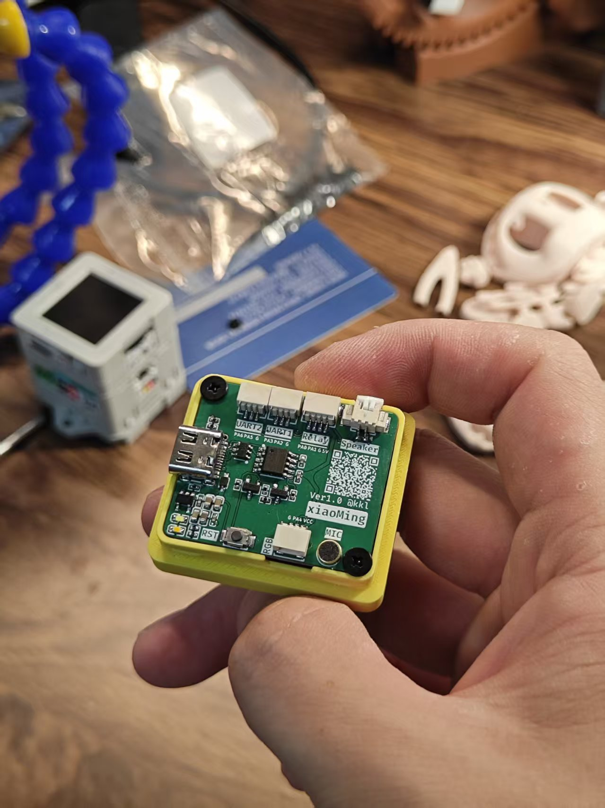

# 💡xiaoMing · 艾利尔芬特

> 可以用语音控制的智能灯箱
>
> _Author: @Hugokkl_

一款基于 **ASRPRO** 语音识别主控 + **WS2812** RGB 灯带打造的智能语音灯箱。

除了基础的语音调色、亮度调节、场景模式之外，还扩展了 **红外学习发射** 与 **433MHz 无线学习发射** 模块：用嘴就能控制空调、氛围灯、桌灯、大灯等家居电器。

## 📑 目录

- [📷 效果预览](#效果预览)
- [✨ 功能特性](#功能特性)
- [📦 材料清单](#材料清单)
- [🔌 硬件连接](#硬件连接)
- [🗣️ 语音指令表](#语音指令表)
- [📡 串口协议](#串口协议)
- [📁 项目结构](#项目结构)
- [🔨 开发 & 烧录](#开发--烧录)
- [⚠️ 已知问题 & 待办](#已知问题--待办)
- [📄 License](#license)

---

## 效果预览



---

## 功能特性

### 灯箱控制（WS2812）

- **多色灯光**：红 / 蓝 / 绿 / 黄 / 白 / 紫 / 橙 / 青 / 粉 / 暖光 / 夜灯
- **亮度调节**：亮一点 / 暗一点 / 正常 / 最高 / 最低（亮度范围 10 ~ 255）
- **场景模式**：日出、下午茶、阅读、睡眠（睡眠模式附带 30 分钟定时自动关灯）
- **彩虹模式**：彩虹流动动画，一句「吃掉彩虹」随时停止

### 语音交互

- **3 个唤醒词**：`柯南同学`、`艾利尔芬特`、`小明`
- **音量调节**：大声点 / 小声点 / 最大 / 最小 / 正常

### 红外遥控（UART1 → 红外学习/发射模块）

- **空调**：开 / 关，以及 21 ~ 25℃ 五档温度
- **氛围灯**：开 / 关 / 亮度 / 8 色切换 / 流水模式
- 支持**任意红外指令**的学习与发射

### 433MHz 无线遥控（UART2 → 433 学习/发射模块）

- **桌灯**：开 / 关 / 亮一点 / 暗一点 / 变暖 / 变冷
- **大灯**：开 / 关
- 支持**任意 433 指令**的学习与发射

---

## 材料清单

| 材料 | 说明 |
| --- | --- |
| ASRPRO 主控 | 语音识别 MCU，板载麦克风与扬声器 |
| WS2812 灯带 × 30 | RGB 灯带，用于灯箱发光 |
| 红外学习/发射模块 | 串口控制，支持任意红外码学习与发射 |
| 433MHz 学习/发射模块 | 串口控制，支持任意 433 码学习与发射 |
| 5V 电源 | 为灯带与模块供电 |
| 灯箱外壳 | 亚克力/木框等自制外壳 |

---

## 硬件连接

| ASRPRO 引脚 | 功能 | 连接 |
| --- | --- | --- |
| PA2 | Serial1 TX（9600） | → 红外模块 RX |
| PA3 | Serial1 RX（9600） | ← 红外模块 TX |
| PA5 | Serial2 TX（9600） | → 433 模块 RX |
| PA6 | Serial2 RX（9600） | ← 433 模块 TX |
| PA4 | WS2812 DIN | → 灯带数据脚 |
| 5V / GND | 电源 | → 灯带 & 模块 |

> 串口波特率均为 **9600**。

---

## 语音指令表

以下指令均在 ASRPRO 工程的 `setup()` 中注册，`ID` 即 `ASR_CODE()` 中 `switch (snid)` 的分支号。

### 唤醒词

| ID | 唤醒词 | 回复 |
| --- | --- | --- |
| 0 | 柯南同学 | 真相永远只有一个！ |
| 26 | 艾利尔芬特 | 我在的呢！ |
| 27 | 小明 | 来啦！ |

### 灯箱灯光

| ID | 指令 | 回复 | 功能 |
| --- | --- | --- | --- |
| 1 | 开灯 | 来咯！ | 打开灯（暖白） |
| 2 | 红灯 | 好的 | 红灯 |
| 3 | 蓝灯 | 好的 | 蓝灯 |
| 4 | 绿灯 | 好的 | 绿灯 |
| 5 | 黄灯 | 好的 | 黄灯 |
| 6 | 白灯 | 好的 | 白灯 |
| 7 | 暖光灯 | 好嘞！ | 暖光灯 |
| 8 | 夜灯 | 来噜！ | 夜灯（低亮度） |
| 9 | 关灯 | 好！ | 关闭灯带 |
| 33 | 紫灯 | 好滴！ | 紫灯 |
| 34 | 橙灯 | 好滴！ | 橙灯 |
| 35 | 青灯 | 好啦！ | 青灯 |
| 36 | 粉灯 | 好啦！ | 粉灯 |

### 场景 & 彩虹

| ID | 指令 | 回复 | 功能 |
| --- | --- | --- | --- |
| 10 | 日出模式 | 好噜，为您切换日出模式！ | 暖色高亮 |
| 11 | 下午茶模式 | 没问题，为您切换下午茶模式！ | 暖色满亮 |
| 12 | 阅读模式 | 好的呢，为您切换阅读模式！ | 白光 |
| 13 | 睡眠模式 | 好滴，晚安！ | 低亮暖光 + 30 分钟定时关灯 |
| 28 | 解除定时 | 好嘞！ | 取消睡眠定时 |
| 31 | 彩虹 | 来噜！ | 彩虹流动动画 |
| 32 | 吃掉彩虹 | 好嘞！遇见彩虹，吃定彩虹！ | 停止彩虹 |

### 亮度 & 音量

| ID | 指令 | 回复 | 功能 |
| --- | --- | --- | --- |
| 21 | 亮一点 | 好的呢！ | 亮度 +25 |
| 22 | 暗一点 | 好的呢！ | 亮度 −25 |
| 23 | 正常亮度 | 好滴！ | 亮度 = 128 |
| 24 | 最高亮度 | 好的呢！ | 亮度 = 255 |
| 25 | 最低亮度 | 好噢！ | 亮度 = 10 |
| 14 | 大声点 | 好的呢！声音调大啦！ | 音量 +1 |
| 15 | 声音大一点 | 好的呢！声音调大啦！ | 音量 +1 |
| 16 | 最大声 | 好的呢！声音已调到最大！ | 音量 = 7 |
| 17 | 小声点 | 好的呢！声音调小啦！ | 音量 −1 |
| 18 | 声音小一点 | 好的呢！声音调小啦！ | 音量 −1 |
| 19 | 最小声 | 好的呢！声音已调到最小！ | 音量 = 1 |
| 20 | 正常音量 | 好的呢！音量已居中！ | 音量 = 4 |
| 29 | 最高音量 | 好！ | 音量 = 7 |
| 30 | 最低音量 | 好！ | 音量 = 1 |

### 红外 · 空调（UART1）

| ID | 指令 | 回复 | 功能 |
| --- | --- | --- | --- |
| 37 | 学习打开空调 | 开始学习！ | 学习「开空调」红外码 |
| 38 | 学习关闭空调 | 开始学习啦！ | 学习「关空调」红外码 |
| 39 | 打开空调 | 好啦！ | 发射「开空调」 |
| 40 | 关闭空调 | 好啦！ | 发射「关空调」 |
| 41 ~ 45 | 学习空调二十五/四/三/二/一 度 | 开始学习(啦)！ | 学习对应温度红外码 |
| 46 ~ 50 | 空调二十五/四/三/二/一 度 | 好啦！ | 发射对应温度（21 ~ 25℃） |

### 红外 · 氛围灯（UART1）

| ID | 指令 | 回复 | 功能 |
| --- | --- | --- | --- |
| 51 / 52 | 学习打开/关闭氛围灯 | 开始学习啦！ | 学习开关码 |
| 53 / 54 | 打开/关闭氛围灯 | 好啦！ | 发射开关 |
| 55 / 56 | 学习氛围灯变亮/变暗 | 开始学习啦！ | 学习亮度码 |
| 57 / 58 | 氛围灯变亮/变暗 | 好啦！ | 发射亮度 |
| 59 ~ 67 | 学习氛围灯红/绿/蓝/橙/青/紫/粉/黄/白色 | 开始学习啦！ | 学习对应颜色码 |
| 68 ~ 76 | 氛围灯红/绿/蓝/橙/青/紫/粉/黄/白色 | 好啦！ | 发射对应颜色 |
| 77 / 78 | 学习氛围灯流水 / 学习流水氛围灯 | 开始学习啦！ | 学习流水模式码 |
| 79 / 80 | 氛围灯流水 / 流水氛围灯 | 好啦！ | 发射流水模式 |

### 433 · 桌灯 & 大灯（UART2）

| ID | 指令 | 回复 | 功能 |
| --- | --- | --- | --- |
| 161 / 162 | 学习打开/关闭桌灯 | 开始学习噜！ | 学习桌灯开关码 |
| 163 / 164 | 打开/关闭桌灯 | 好啦！ / 好噜！ | 发射桌灯开关 |
| 165 / 166 | 学习桌灯亮一点/变暖 | 开始学习噜！ | 学习桌灯亮度码 |
| 167 / 168 | 桌灯亮一点/变暖 | 好嘞！ | 发射桌灯亮度 |
| 169 / 170 | 学习桌灯暗一点/变冷 | 开始学习噜！ | 学习桌灯亮度码 |
| 171 / 172 | 桌灯暗一点/变冷 | 好嘞！ | 发射桌灯亮度 |
| 173 / 174 | 学习打开/关闭大灯 | 开始学习噜！ | 学习大灯开关码 |
| 175 / 176 | 打开/关闭大灯 | 好嘞！ | 发射大灯开关 |
| 177 | 回家模式 | 欢迎回来！ | 待实现 |
| 178 | 出门模式 | 路上小心噢，早点回来！ | 待实现 |

---

## 串口协议

红外与 433 模块均通过 **9600 波特率** 串口通信，指令为 **4 字节 ASCII** 文本：

| 前缀 | 含义 |
| --- | --- |
| `xx` | 进入**学习**模式（学习对码后自动存储） |
| `fs` | **发射**已学习的指令 |

格式：`xx` 或 `fs` + 2 位十六进制指令号。

**示例**（红外，Serial1）：

```text
xx00   → 学习「打开空调」
fs00   → 发射「打开空调」
fs12   → 发射「空调 21 度」
xx40   → 学习「氛围灯流水」
```

**示例**（433，Serial2）：

```text
xx00   → 学习「打开桌灯」
fs00   → 发射「打开桌灯」
fs12   → 发射「打开大灯」
```

---

## 项目结构

```
xiaoMing/
├── README.md            # 本文件
├── LICENSE              # MIT 许可证
├── backup.cpp           # 本地代码备份（已被 .gitignore 忽略）
├── Firmware/
│   └── xiaoming.hd      # ASRPRO 固件工程（主代码）
├── Hardware/            # 硬件资料（预留目录）
├── Pics/                # 项目图片
│   └── 5e28a60d....jpg  # 效果预览图
└── .vscode/
    └── settings.json    # 编辑器配置（已被 .gitignore 忽略）
```

---

## 开发 & 烧录

1. 安装 **天问 Block（ASRPRO）** 开发环境。
2. 打开 `Firmware/xiaoming.hd` 工程。
3. 在工程内调整唤醒词、命令词与 `ASR_CODE()` 分支逻辑。
4. 编译并下载到 ASRPRO 主控（ASRPRO 板载下载/串口烧录）。

> 语音识别逻辑与工程配置（唤醒词、命令词、回复语）均在 `setup()` 中通过 `{ID:xx, keyword:"...", ASR:"...", ASRTO:"..."}` 注释定义，由 IDE 解析为语音模型。

---

## 已知问题 & 待办

1. **回家模式 / 出门模式**（`case 177/178`）：尚未实现，`case 178` 仅有注释 TODO。

---

## License

[MIT](LICENSE) © 2025 kkl
